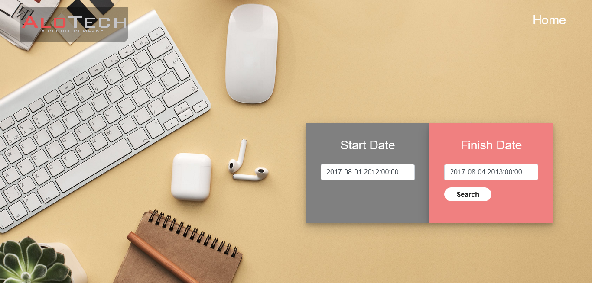
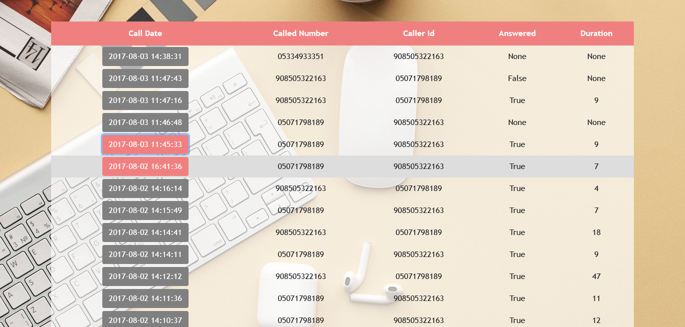
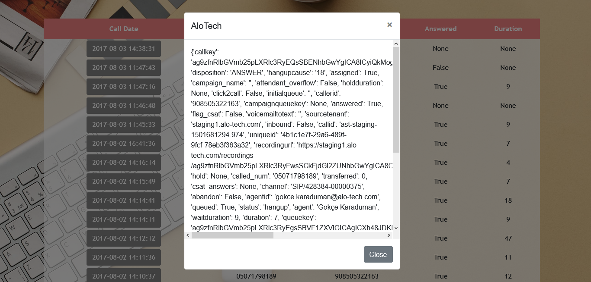

# Filter Call -Python-Flask
Information Measurement Project

* This Project can be connected by Google Cloud App Engine [https://hasandalkilic2020.ey.r.appspot.com/](https://hasandalkilic2020.ey.r.appspot.com/)

It is a set of operations we get servers to execute 

* Search in Call List database on "/"
* Fetch data from base domain url with "Request" Module
* Listed Calling on "/api" url
* Generate dynamic Modal (PopUp) 
* Designed with BootStrap 4.1.1

## Flask Web Framework and Requests Module  installed
``` 
pip install flask
pip install requests
```

## Installed dependcies packages
- Flask==1.1.2
- gunicorn==20.0.4
- click==7.1.2
- itsdangerous==1.1.0
- Jinja2==2.11.2
- MarkupSafe==1.1.1
- Werkzeug==1.0.1

## Connect to database
* Used <b>Request</b> module in order to connect <b>Company API</b> 
* This project deployment to Google Cloud App Engine system

## Designed by using MVC construction
| MODEL | VIEW | CONTROLLER |
|---| --- | --- |
| Flask | Jinja | Python 3.8 |

## Landing Page with Home/Users Link


## Users Table could be edited/added/deleted


## Add user form into database


